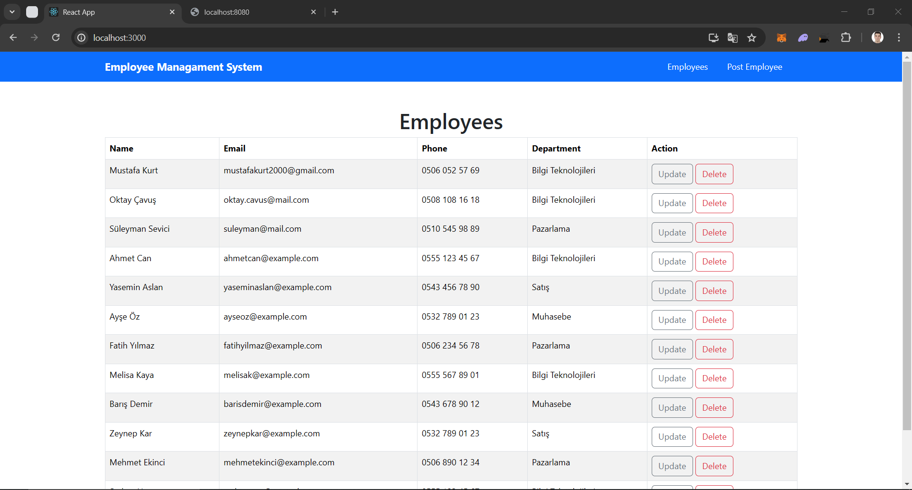
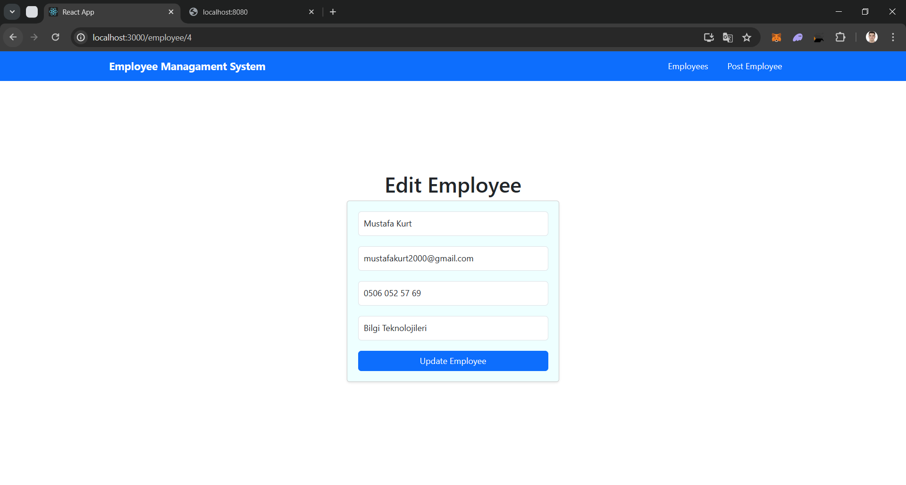

---

# Employee CRUD Uygulaması

Bu proje, bir işçi (employee) veritabanı yönetim uygulamasıdır. Uygulama, çalışanların eklenmesini, güncellenmesini, silinmesini ve listelenmesini sağlar. Aşağıdaki video, projenin çalışmasını ve nasıl kullanılacağını göstermektedir:

[Employee CRUD](https://www.youtube.com/watch?v=5zArepYoSYA)

## 💻 Kullanılan Teknolojiler

- Spring Boot
- React.js
- MySQL


## 🚀 Ekran Görüntüleri


_Anasayfa: Tüm çalışanların listelendiği sayfa_


_Yeni Çalışan Ekleme Formu: Yeni bir çalışan eklemek için kullanılan form_


_Çalışanı Güncelleme Formu: Var olan bir çalışan güncellemek için kullanılan form_


## 🔍 Postman İstekleri

Postman ile uygulamaya erişmek için aşağıdaki istekleri kullanabilirsiniz:

- **GET**: Tüm çalışanları listeleme  
  `http://localhost:8080/api/employees`

- **POST**: Yeni çalışan ekleme  
  `http://localhost:8080/api/employee`  
  ```json
  {
      "name": "Employee Name",
      "email": "employee@mail.com",
      "phone": "0500 100 10 10",
      "department": "HR"
  }
  ```

- **PATCH**: Çalışan bilgilerini güncelleme  
  `http://localhost:8080/api/employee/1`  
  ```json
  {
      "name": "Updated Name",
      "email": "updatedName@mail.com",
      "phone": "0510 101 01 10",
      "department": "IT"
  }
  ```

- **DELETE**: Çalışanı silme  
  `http://localhost:8080/api/employee/1`

- **GET**: Çalışanı ID'ye göre getirme  
  `http://localhost:8080/api/employee/1`


## 📝 Kullanım

- Ana sayfada ve "Employees" butonuna tıklandığında tüm çalışanlar listelenir.
- Yeni bir çalışan eklemek için "Post Employee" butonuna tıklayın ve gerekli bilgileri girin.
- Her çalışanın yanındaki "Edit" butonuna tıklayarak bilgilerini güncelleyin.
- Bir çalışanı silmek için "Delete" butonuna tıklayın.


##  🗺️ Kurulum

1. **Projeyi İndirin**: GitHub üzerinden projeyi klonlayın veya ZIP olarak indirin.

2. **Veritabanı Ayarları**:
   - MySQL veritabanı oluşturun.
   - `backend/src/main/resources/application.properties` dosyasında, MySQL veritabanı bağlantı bilgilerini güncelleyin.

3. **Projeyi Çalıştırma**:
   - Terminal veya komut istemcisinde `backend` dizinine gidin ve `mvn spring-boot:run` komutunu çalıştırın.
   - Frontend kısmını çalıştırmak için terminalde `frontend` dizinine gidin ve `npm install` komutunu çalıştırın. Daha sonra `npm start` komutunu kullanarak frontend'i başlatın.

4. **Tarayıcıda Gösterim**: Tarayıcınızda [http://localhost:3000](http://localhost:3000) adresine giderek uygulamayı görüntüleyin.


## 💬 Katkıda Bulunma

1. Bu depoyu fork edin.
2. Yeni özellikler veya hata düzeltmeleri için bir dal oluşturun (`git checkout -b feature/feature-name` veya `git checkout -b bugfix/bug-name`)
3. Değişikliklerinizi doğrulayın (`git commit -am 'Add new feature'`)
4. Dallarınızı ana depoya push edin (`git push origin feature/feature-name` veya `git push origin bugfix/bug-name`)
5. Bir pull isteği (pull request) açın.


---